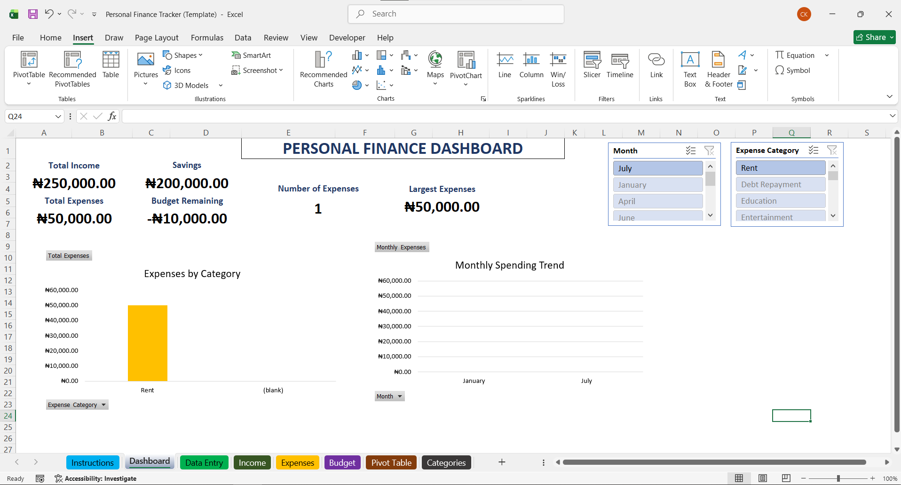
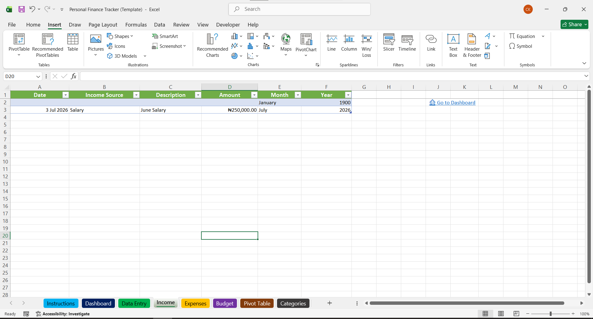
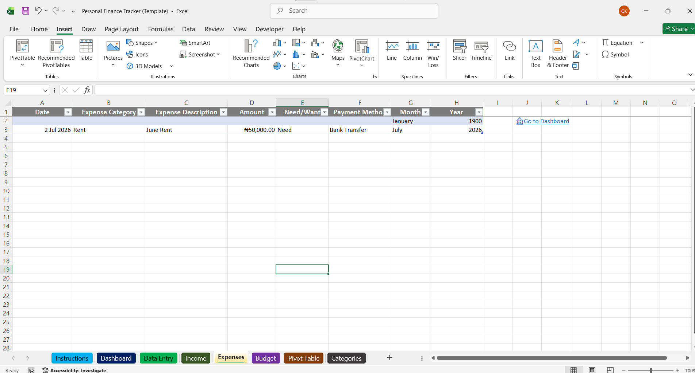
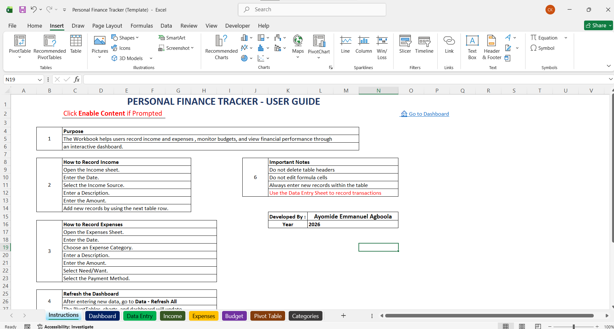

# 💰 Personal Finance Tracker

An interactive Personal Finance Tracker built with **Microsoft Excel 2021** and **VBA** to help individuals record income and expenses, monitor budgets, and visualize their financial performance through an interactive dashboard.

This project demonstrates how Excel can be transformed into a simple financial management application by combining automation, data validation, dashboards, PivotTables, and VBA.

## 📌 Project Overview

Managing personal finances can become difficult without an organized system for recording income, expenses, and budgets. This tracker was developed to provide an easy-to-use solution that enables users to:

- Record income and expenses through a user-friendly data entry form.
- Monitor spending against planned budgets.
- View key financial metrics on an interactive dashboard.
- Analyze spending patterns using PivotTables and PivotCharts.
- Reduce manual work through VBA automation.

## ✨ Features

- Income Tracking
- Expense Tracking
- Budget Management
- Interactive Dashboard
- Automated Data Entry using VBA
- Input Validation
- Automatic Month and Year Generation
- PivotTables
- PivotCharts
- Interactive Slicers
- Conditional Formatting
- Excel Tables
- Financial KPIs

## 🛠 Technologies Used

- Microsoft Excel 2021
- Visual Basic for Applications (VBA)
- Excel Tables
- PivotTables
- PivotCharts
- Slicers
- Data Validation
- Conditional Formatting
- Financial Dashboard Design

## 📷 Project Screenshots

### Dashboard

### Data Entry Form

### Income Sheet

### Expenses Sheet

### Instructions

## 🚀 How to Use

1. Download **Personal Finance Tracker.xlsm**.
2. Open the workbook using **Microsoft Excel**.
3. Click **Enable Content** if prompted.
4. Read the Instructions sheet.
5. Use the Data Entry sheet to record income and expenses.
6. View reports and financial insights on the Dashboard.

## 📊 Dashboard Highlights

The dashboard provides:

- Total Income
- Total Expenses
- Net Savings
- Budget Status
- Monthly Spending Trend
- Expenses by Category
- Interactive Filtering with Slicers

## 🔍 Skills Demonstrated

This project demonstrates practical skills in:

- Excel Dashboard Development
- Financial Reporting
- Data Visualization
- Business Analysis
- VBA Automation
- Excel Tables
- PivotTables
- PivotCharts
- Data Validation
- Financial Data Management
- User Interface Design

## 📁 Repository Structure

personal-finance-tracker/
│
├── Personal Finance Tracker.xlsm
├── README.md
├── LICENSE
│
└── screenshots/
    ├── dashboard.png
    ├── data-entry.png
    ├── income.png
    ├── expenses.png
    ├── budget.png
    └── instructions.png

## 🔮 Future Improvements

Future versions of this project may include:

- Automatic PDF report generation
- Email reporting
- Multi-user support
- Password-protected administration
- Enhanced financial analytics
- Data backup and recovery
- Advanced VBA automation

## 👨‍💻 Author

**Ayomide Emmanuel Agboola**

If you found this project useful, feel free to connect with me.

- LinkedIn: *www.linkedin.com/in/ayomide-e-agboola*

## ⭐ Support

If you like this project, please consider giving it a ⭐ on GitHub.
